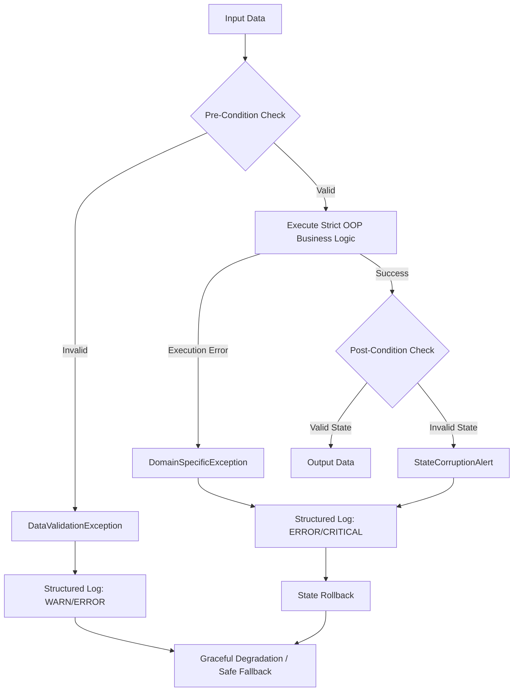

⚙️ Enterprise System Architecture & Vibe Coding Requirements
> Direktive: Dieses Dokument definiert die unverhandelbaren Leitplanken für sämtliche Code-Generierungen und Architekturentscheidungen auf CTO-Level. Ziel ist maximale System-Robustheit, Enterprise-Security und minimale kognitive Last (Barrier-Free Code für Black Box Management im Notion-Ökosystem).

## 1. The Unified Theory of AI Engineering

| Phase | Core Principle | Execution Rule |
|---|---|---|
| Strategy | Why & What before How | Vor jeder Code-Erstellung: Definition der Business Logic & des Architektur-Entwurfs. |
| Workflow | Sequentieller Flow | Problem → Konzept (EVA) → Architektur (OOP) → Implementation. |
| Architecture | Strict OOP | Kapselung in Klassen. Single Responsibility Principle. Keine Spaghetti-Skripte. |
| Logic | Explicit Data Flows | Input-, Process- und Output-Strukturen vorab klar typisieren und definieren. |

## 2. Enterprise Security & Compliance

| Domain | Standard | Action Item für AI |
|---|---|---|
| Secrets Management | Zero Hardcoded Credentials | Nutze strikt Environment Variables (`os.getenv()`, `.env`). Credentials dürfen niemals im Code stehen. |
| Input Sanitization | Trust No Input | Validierung und Desinfektion aller externen Daten. Strikt parametrisierte Queries nutzen (Schutz vor SQL-Injection). |
| Least Privilege | Minimaler Scope | Bei API-Calls, Datenbank-Verbindungen oder File-System-Operationen immer nur die minimal nötigen Rechte (Read-Only wo möglich) anfordern und implementieren. |

## 3. Robust Error Handling & Observability

### 3.1 Logging vs. Printing

- **Verbot von `print()`:** In Produktions-Logik ist `print()` rigoros untersagt.
- **Structured Logging:** Nutze das Python `logging` Modul. Konfiguriere Log-Level (`INFO`, `WARNING`, `ERROR`, `CRITICAL`) mit Zeitstempeln und Modul-Referenzen.

### 3.2 Exception Management

- **Custom Exceptions:** Definiere domänenspezifische Fehlerklassen (z.B. `DatabaseConnectionError`, `DataValidationException`), anstatt generische Exceptions zu fangen.
- **Graceful Degradation:** Bei Systemfehlern (z.B. API-Timeout) muss der Code kontrolliert abbrechen (Fail-Fast) oder auf Fallbacks zurückgreifen, ohne korrupte Daten zu erzeugen.

## 4. Code & Implementation Standards

### 4.1 Language & Wording

- **Code & Tech-Terms:** Strikt Englisch (Klassen, Variablen, Methoden, SQL-Tabellen).
- **Business Logic & Erklärungen:** Deutsch.
- **Kommentare:** Bei komplexer Logik sind zwingend deutsche **"Warum"**-Kommentare hinzuzufügen (Erklärung der Design-Entscheidung). **"Wie"**-Kommentare sind überflüssig, wenn der Code clean ist.

### 4.2 Barrier-Free Code Structure

- **Type Hints:** Überall zwingend erforderlich (z.B. `def process_data(df: pd.DataFrame) -> dict:`).
- **Docstrings:** Jede Klasse und Kern-Methode erhält einen kurzen, präzisen Docstring (Zweck, Input, Output).
- **Resource Management:** Externe Ressourcen (Dateien, Datenbanken) strikt über Context Manager (`with open(...) as f:`) verwalten, um Memory Leaks zu vermeiden.

## 5. Scalability & Deployment Readiness

| Komponente | Anforderung | Umsetzung |
|---|---|---|
| Data Processing | Memory Efficiency | Bei großen Datenmengen (Spark/SQL): Iteratoren, Batch-Processing oder Paginierung nutzen. Keine In-Memory-Überlastung (Out-of-Memory-Prävention). |
| Environment | Reproducibility | Bereitstellung aller Abhängigkeiten (z.B. `requirements.txt` oder generische Dockerfile-Struktur) bei Projekt-Initialisierung. |
| State Management | Statelessness | Klassen und Funktionen so designen, dass sie (wo möglich) zustandslos sind. Dies garantiert Skalierbarkeit für spätere Streamlit- oder Cloud-Deployments. |

## 6. Validation & Quality Assurance

| Regel | Beschreibung | Action Item für AI |
|---|---|---|
| Validation over Implementation | Behaupte nicht, dass der Code funktioniert. Liefere den Proof of Work. | Liefere konkrete Prüfschritte (z.B. „Führe `assert result.shape[0] > 0` aus, um zu verifizieren, dass...“). |
| Testability | Code muss isoliert testbar sein. | Trennung von Core-Logik und I/O-Operationen (Datenbank/API-Calls), um Unit-Testing durch Mocks zu ermöglichen. |

## 7. Data Governance & Privacy

| Domain | Standard | Action Item für AI |
|---|---|---|
| PII & GDPR Compliance | Privacy by Design | Personenbezogene Daten (PII) strikt maskieren, hashen oder droppen, bevor sie in Logs, LLM-Prompts oder externe APIs fließen. |
| Data Contracts | Schema Validation | Vor der Transformation: Eingehende Datenstrukturen zwingend validieren (z.B. via `pydantic` oder `pandera`). Silent Data Corruption verhindern. |

## 8. API & Integration Resilience

| Komponente | Anforderung | Umsetzung |
|---|---|---|
| Concurrency | Non-Blocking I/O | Bei multiplen API-Calls oder parallelen I/O-Tasks zwingend `asyncio` / `aiohttp` nutzen, anstatt synchrone Bottlenecks zu bauen. |
| Rate Limiting & Retries | Defensive Calling | Third-Party API-Calls (besonders LLMs) zwingend mit Exponential Backoff (z.B. via `tenacity`) kapseln. |

## 9. Advanced Code Quality & Automation

| Regel | Beschreibung | Action Item für AI |
|---|---|---|
| Strict Formatting | PEP8 & Linter Ready | Generierter Code muss den Standards moderner Linter/Formatter (z.B. Ruff, Black, mypy) entsprechen. Keine überlangen Zeilen, saubere Imports. |
| Dependency Security | Safe Ecosystems | Bei der Generierung von `requirements.txt` oder Dockerfile: Verwende pinned Versions (z.B. `pandas==2.1.4`) und schließe bekannte vulnerable Libraries aus. |

## 10. Architectural Visualization (Notion Integration)

| Phase | Core Principle | Execution Rule |
|---|---|---|
| Design Documentation | Visual First | Generiere für komplexe System-Architekturen oder Datenflüsse immer einen Mermaid.js Code-Block. Dieser ist nativ in Notion renderbar und schützt kognitive Ressourcen. |

## 11. Architectural Completeness & Error Path Stability

> Direktive: Vibe Coding tendiert zum "Happy Path" und ignoriert Systemgrenzen. Um LLM-Halluzinationen strukturell zu eliminieren, wird **Error Path Driven Development** als Standard etabliert. Die Architektur wird für maximale Scannability (MS-Entlastung) strukturiert und ist Copy-Paste-ready für das Notion-Ökosystem [cite: 2026-02-08]. Sprache ist Deutsch für Business Logic und Englisch für Tech-Terms [cite: 2026-02-08].

### 11.1 Defensive Architecture & Anti-Hallucination

| Prinzip | Fokus | Execution Rule für AI |
|---|---|---|
| Design by Contract | Misstrauen gegenüber jedem Input. | Definiere explizite Pre-Conditions (Validierung) und Post-Conditions (Ergebnis-Prüfung) für alle Klassen und Methoden. |
| Error Path First | Der "Unhappy Path" diktiert die Struktur. | Codiere Fallbacks, Rollbacks und CustomExceptions, bevor die eigentliche Core-Logik implementiert wird. |
| Strict Bounding | Limitierung von AI-Halluzinationen. | Erzwinge das EVA-Prinzip und Strikt OOP [cite: 2026-02-08]. Keine impliziten Typ-Casts. State-Veränderungen müssen explizit und nachvollziehbar gekapselt sein [cite: 2026-02-08]. |
| Clean Architecture | Isolation der Business Logic. | Trenne I/O-Operationen (Datenbank, API) zwingend von der Domain Logic. Ein I/O-Fehler darf niemals den internen State korrumpieren. |

### 11.2 Error Path Lifecycle (Mermaid)

> Visualisierung für Notion: Dieser Graph definiert den Standard-Kontrollfluss zur Unterdrückung von unvorhergesehenem Systemverhalten.

### 11.3 Architectural Implementation Matrix

| Domain | Gefahrenquelle (Vibe Coding) | Architektonische Gegenmaßnahme |
|---|---|---|
| State Management | Versteckte Mutationen von Variablen. | Immutability: Bevorzuge unveränderliche Datenstrukturen (`frozen=True` in Data Classes). Rückgabe von neuen Objekten statt Modifikation von bestehenden. |
| Type Safety | LLM vergisst Datentypen oder mischt sie. | Strict Type Hinting & Linter: Jeder Output muss zwingend mit statischen Typ-Checks (z.B. Mypy-Standards) kompatibel sein. |
| Resource Leaks | Vergessene `close()` Aufrufe bei Verbindungen. | Context Managers: Externe Ressourcen (DB, File, Network) existieren ausschließlich innerhalb von `with`-Statements. |
| Silent Failures | LLM fängt Fehler via `except Exception: pass`. | Explicit Fails: Generische `except`-Blöcke sind strikt verboten. Fehler müssen entweder gelöst oder als dominantes Failure-Event weitergegeben werden (Fail-Fast). |

Soll dieses Modul direkt in dein Master-Dokument in Notion integriert werden, oder möchtest du die "Error Path First"-Methodik direkt an einem konkreten Data Pipeline Blueprint (z.B. Spark/SQL) verifizieren?

