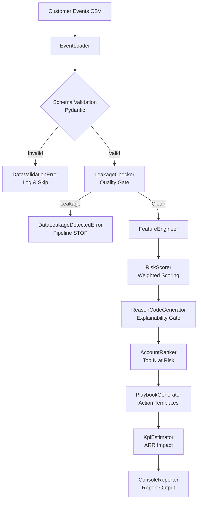

# Churn Early Warning + Playbook Generator

> **Pain Point:** Retention reagiert zu spät. Churn-Signale existieren, aber niemand weiß, was zu tun ist.

Ein Enterprise-grade Frühwarnsystem, das Customer-Event-Daten in priorisierte, erklärbare Risk Scores + konkrete Handlungsempfehlungen (Playbooks) verwandelt.

---

## Architecture



---

## EVA-Prinzip

| Phase | Komponente | Output |
|---|---|---|
| **E**ingabe | `EventLoader` → Pydantic Validation | `CustomerEvent[]` |
| **V**erarbeitung | `FeatureEngineer` → `RiskScorer` → `AccountRanker` | `RiskAssessment[]` |
| **A**usgabe | `PlaybookGenerator` → `KpiEstimator` → `ConsoleReporter` | `Playbook[]` + Report |

---

## Quality Gates

| Gate | Komponente | Verhalten bei Fehler |
|---|---|---|
| Schema Validation | `CustomerEvent` (Pydantic) | Ungültige Zeilen werden geloggt & übersprungen |
| Data Leakage | `LeakageChecker` | Pipeline stoppt mit `DataLeakageDetectedError` |
| Explainability | `ReasonCodeGenerator` | Jeder Score hat ≥ 1 erklärbaren Reason Code |
| Score Bounding | `RiskScorer` | Score ist immer 0–100 |

---

## Projektstruktur

```
churn-early-warning/
├── main.py                     # Einstiegspunkt
├── config/
│   └── settings.py             # Konfiguration via Environment Variables
├── src/
│   ├── exceptions.py           # Domain-spezifische Exception-Hierarchie
│   ├── models/
│   │   ├── customer_event.py   # Pydantic Input-Schema
│   │   ├── risk_assessment.py  # Risk Score + Reason Codes Modelle
│   │   └── playbook.py         # Output: Action Items + KPI Impact
│   ├── ingestion/
│   │   └── event_loader.py     # CSV-Loader mit Validierung
│   ├── processing/
│   │   ├── feature_engineer.py # Feature Engineering (normalisiert)
│   │   ├── risk_scorer.py      # Gewichteter Risk Score
│   │   ├── reason_codes.py     # Regelbasierte Reason Codes
│   │   └── leakage_checker.py  # Data Leakage Quality Gate
│   ├── output/
│   │   ├── account_ranker.py   # Top-N Ranking (Score × ARR)
│   │   ├── playbook_generator.py # Action Templates (segment-spezifisch)
│   │   └── kpi_estimator.py    # ARR-Impact-Berechnung
│   ├── reporting/
│   │   └── console_reporter.py # Strukturierter Report Output
│   └── pipeline.py             # Haupt-Orchestrator (EVA-Flow)
├── data/sample/                # Beispieldaten (25 synthetische Accounts)
├── tests/                      # Unit Tests (pytest)
├── .env.example                # Konfigurationsvorlage
├── requirements.txt            # Pinned Dependencies
└── Dockerfile                  # Container-Deployment
```

---

## Setup & Usage

### 1. Lokale Installation

```bash
# Repository klonen
git clone <repo-url>
cd churn-early-warning

# Virtual Environment erstellen
python3.12 -m venv venv
source venv/bin/activate  # Windows: venv\Scripts\activate

# Dependencies installieren
pip install -r requirements.txt

# Konfiguration kopieren
cp .env.example .env
```

### 2. Web-App starten (empfohlen)

```bash
python run_server.py
# → http://localhost:8000
# → API-Docs: http://localhost:8000/docs
```

### 3. CLI-Pipeline (ohne Web-Interface)

```bash
python main.py
# Konfiguration via Env-Vars:
CHURN_DATA_SOURCE=data/my_events.csv CHURN_TOP_N_ACCOUNTS=10 python main.py
```

### 4. Tests ausführen

```bash
pytest tests/ -v --cov=src
```

### 5. Docker

```bash
docker build -t churn-pipeline .
docker run -p 8000:8000 -e CHURN_TOP_N_ACCOUNTS=10 churn-pipeline
```

---

## API-Endpunkte

| Methode | Endpunkt | Beschreibung |
|---|---|---|
| `GET` | `/` | Web-Interface (Single-Page App) |
| `POST` | `/api/analyze` | CSV hochladen → Risk Report als JSON |
| `GET` | `/api/sample` | Sample-CSV herunterladen |
| `GET` | `/api/health` | Health Check |
| `GET` | `/docs` | Automatische OpenAPI-Dokumentation |

---

## CSV-Eingabeformat

| Spalte | Typ | Beschreibung |
|---|---|---|
| `account_id` | str | Eindeutige Account-ID |
| `account_name` | str | Anzeigename |
| `event_date` | date (YYYY-MM-DD) | Datum der Datenerhebung |
| `annual_recurring_revenue` | float | ARR in Euro |
| `logins_last_7d` | int | Logins der letzten 7 Tage |
| `logins_last_30d` | int | Logins der letzten 30 Tage |
| `logins_last_90d` | int | Logins der letzten 90 Tage |
| `open_tickets` | int | Aktuell offene Support-Tickets |
| `resolved_tickets_last_30d` | int | Gelöste Tickets (30d) |
| `escalated_tickets_last_90d` | int | Eskalierte Tickets (90d) |
| `nps_score` | float \| None | Net Promoter Score (-100 bis 100) |
| `nps_trend` | float \| None | NPS-Veränderung zum Vormonat |
| `feature_adoption_rate` | float (0-1) | Anteil genutzter Features |
| `active_users_last_30d` | int | Aktive User (30d) |
| `active_users_last_90d` | int | Aktive User (90d) |
| `contract_end_date` | date \| None | Vertragsende (YYYY-MM-DD) |
| `customer_segment` | str | `HIGH_VALUE` \| `MID_MARKET` \| `SMB` |

---

## Risk Score Formel

Der Score basiert auf 6 gewichteten Dimensionen:

| Dimension | Gewicht | Signal |
|---|---|---|
| Login Drop Rate | 30% | Starker Rückgang in 7d vs. 30d |
| Ticket Intensity | 20% | Eskalationsrate + offene Tickets |
| NPS | 20% | Niedriger oder sinkender NPS |
| Feature Adoption | 15% | Geringe Feature-Nutzung |
| User Activity Drop | 10% | Rückgang aktiver User |
| Renewal Pressure | 5% | Vertragsende <90 Tage |

**Klassifizierung:** CRITICAL (≥75) | HIGH (≥50) | MEDIUM (≥25) | LOW (<25)

---

## Technologie-Stack

- **Python 3.12** – Sprache
- **Pydantic v2** – Schema-Validierung & Data Contracts
- **Pandas** – CSV-Verarbeitung
- **pytest** – Unit Testing
- **Ruff / mypy** – Linting & Type Checking

---

## Code-Standards

Dieses Projekt folgt den Enterprise Code Guidelines:
- Strikte OOP (Single Responsibility Principle)
- EVA-Architektur (Input → Processing → Output)
- Zero Hardcoded Credentials (Environment Variables)
- Kein `print()` – strukturiertes Logging
- Type Hints & Docstrings überall
- Custom Exception Hierarchie
- Error Path First Development
